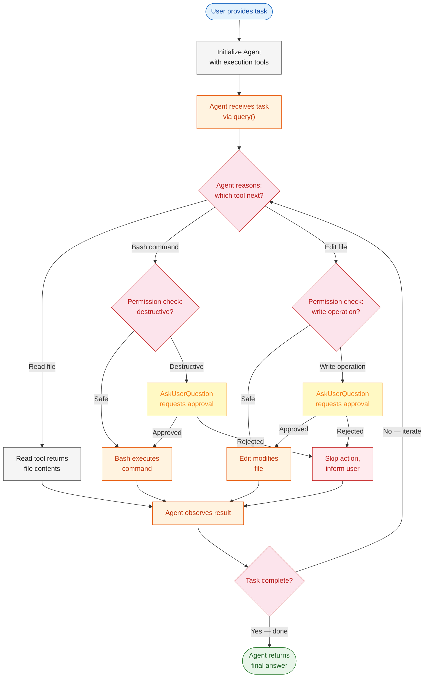
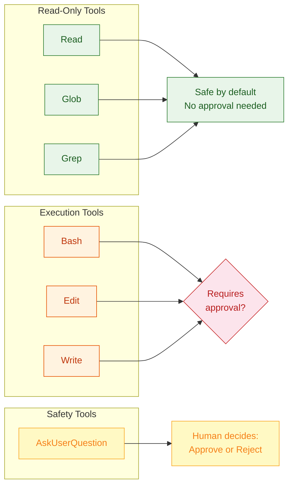
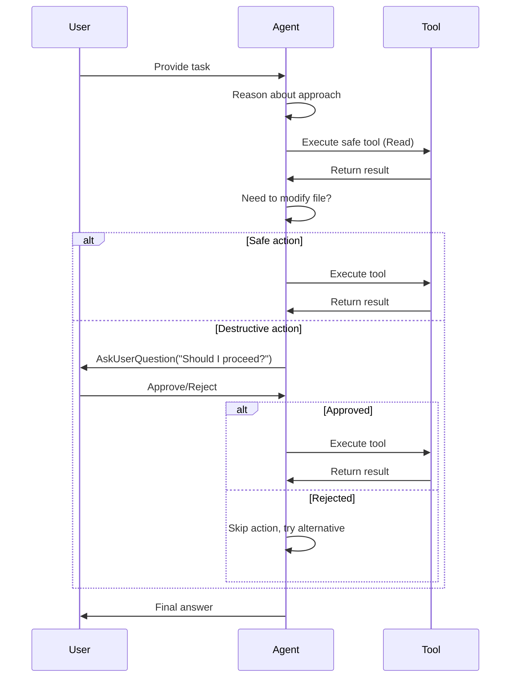

# Module 2: Safe Execution & Human-in-the-Loop

> **Giving an agent write access or bash capabilities requires strict guardrails.** Without proper permission controls, an autonomous agent could accidentally delete files, overwrite code, or execute dangerous commands. This module teaches you how to implement execution tools safely with human approval gates.

---

# Problem Statement / Use Case Overview

How do we build an agent that can modify code and execute terminal commands while ensuring destructive actions require explicit human approval?

**The pipeline works in three stages:**

1. **Agent initialization** — Configure an agent with execution tools (Bash, Edit, Write) and permission controls.
2. **Autonomous execution with guardrails** — The agent reasons about tasks, executes tools, and pauses for human confirmation on destructive actions.
3. **Safe modification** — The agent updates dependencies and verifies changes by running tests, with human oversight at critical decision points.

This is especially useful for:
- **Automated dependency updates and refactoring**
- **Code migration and transformation tasks**
- **CI/CD pipeline automation with approval gates**
- **Any task where an LLM needs to modify files or run commands safely**

---

# Input Data

| Item | Detail |
|------|--------|
| **System prompt** | Instructions defining the agent's role and safety constraints |
| **User task** | Natural-language task describing what the agent should do |
| **Target project** | Path to a project with outdated dependencies |
| **Allowed tools** | `Bash`, `Edit`, `Write`, `AskUserQuestion` |
| **Permission mode** | Configuration requiring human approval for destructive actions |
| **Anthropic API Key** | Used to authenticate with the Claude API |

---

# Processing

### Overall Workflow



### Execution Tools Overview



1. **Read-only tools** (`Read`, `Glob`, `Grep`) — Safe by default. The agent can explore files without any risk of modification.
2. **Execution tools** (`Bash`, `Edit`, `Write`) — Can modify the system. Require permission controls to prevent unintended changes.
3. **Safety tool** (`AskUserQuestion`) — Allows the agent to pause and ask for human clarification when uncertain about an action.

### Permission Modes

| Mode | Behavior | Use Case |
|------|----------|----------|
| `auto` | All tools execute without approval | Trusted environments, read-only tasks |
| `require_approval` | Destructive actions require human confirmation | Production systems, code modification |
| `reject_all` | Write operations are blocked | Exploratory tasks, auditing only |

### The `AskUserQuestion` Tool

When the agent is uncertain about a decision, it can use `AskUserQuestion` to present options to the human:

```python
# Agent can ask: "Should I update this dependency?"
# Human responds with a choice from the provided options
response = agent.query(
    task="Update the outdated dependency",
    tools=[Bash(), Edit(), AskUserQuestion()]
)
```

This creates a **human-in-the-loop** pattern where:
1. Agent identifies an action that needs clarification
2. Agent presents the question with multiple-choice options
3. Human reviews and selects an option
4. Agent continues based on the human's decision

---

# Output

A modified project with updated dependencies and passing tests. The agent produces a summary of changes made:

> ## Refactoring Summary
>
> ### Dependencies Updated
> - `requests==2.28.0` → `requests==2.31.0`
> - `numpy==1.24.0` → `numpy==1.26.0`
>
> ### Changes Made
> - Updated `requirements.txt` with new versions
> - Ran `pip install -r requirements.txt` to install updates
> - Executed test suite: `pytest tests/`
> - All 12 tests passed
>
> ### Verification
> - No breaking changes detected
> - All imports resolved correctly
> - Test coverage maintained at 85%

---

# Tech Stack

| Component | Tool |
|---|---|
| **Agent SDK** | Anthropic Agent SDK (`claude_agent_sdk`) — orchestrates the tool-use loop |
| **LLM (Agent)** | Claude via Anthropic API — reasons about tasks and selects tools |
| **LLM (Judge)** | Free model via OpenRouter — evaluates agent output |
| **Execution Tools** | `Bash`, `Edit`, `Write` — file and command execution capabilities |
| **Safety Tools** | `AskUserQuestion` — human-in-the-loop clarification |
| **Language** | Python 3.10+ |
| **Environment** | `ANTHROPIC_API_KEY` (SDK), `OPENROUTER_API_KEY` (Judge) |

---

# Underlying Concepts (Summarized)

### Execution Tools vs Read-Only Tools

| Aspect | Read-Only Tools | Execution Tools |
|--------|----------------|-----------------|
| **Risk level** | None — cannot modify system | High — can delete, overwrite, execute |
| **Permission required** | No | Yes (depends on mode) |
| **Examples** | `Read`, `Glob`, `Grep` | `Bash`, `Edit`, `Write` |
| **Use case** | Exploration, auditing | Modification, refactoring |

### Permission Mode Configuration

The Agent SDK provides built-in permission controls for execution tools. When you include `Bash`, `Edit`, or `Write` in your tools list, the SDK automatically:

- Validates commands before execution
- Blocks dangerous operations (like `rm -rf`, `git push --force`)
- Logs all tool calls for auditing
- Supports human-in-the-loop via `AskUserQuestion`

```python
from claude_agent_sdk import query, ClaudeAgentOptions

options = ClaudeAgentOptions(
    allowed_tools=["Bash", "Edit", "AskUserQuestion"],
)

# The SDK handles permission checks automatically
response = query("Update the outdated dependency", options=options)
```

### Human-in-the-Loop Pattern



### Safe Execution Checklist

Before giving an agent execution capabilities:

1. **Start with read-only tools** — Verify the agent can explore and understand the codebase
2. **Add execution tools incrementally** — Introduce `Bash` or `Edit` one at a time
3. **Configure permission mode** — Use `require_approval` for production environments
4. **Test with safe commands first** — Try `ls`, `cat`, `git status` before `rm`, `git push`
5. **Monitor agent behavior** — Watch tool calls to ensure the agent doesn't take unexpected actions
6. **Implement rollback** — Ensure you can revert changes if the agent makes mistakes

---

# Pre-requisites

- **Basic familiarity** with Python (functions, `import` statements).
- **Anthropic API Key** — for the Agent SDK (sign up at [console.anthropic.com](https://console.anthropic.com)).
- **OpenRouter API Key** — for the free LLM Judge (sign up at [openrouter.ai](https://openrouter.ai)).
- **Python 3.10+** installed on your machine.
- **A project with dependencies** — a `package.json` or `requirements.txt` with outdated versions.
- **High-level understanding** of what an LLM is and what "tool use" means.
- **Understanding of basic shell commands** — `ls`, `cat`, `pip`, `npm`, etc.

---

# Environment / Dependencies Setup

The cell below installs all required Python packages:

| Package | Purpose |
|---------|---------|
| `claude-agent-sdk` | **Agent SDK** — orchestrates the autonomous tool-use loop with permission controls |
| `python-dotenv` | **Environment** — loads API keys from .env file |

> **Note:** Run this cell first — it only needs to be run once per session.

```python
!pip install -q claude-agent-sdk python-dotenv
```

## Import Libraries

Import the standard library and third-party modules used throughout the notebook. **`os`** handles environment variables. **`claude_agent_sdk`** provides the `query()` function and `ClaudeAgentOptions` for configuring the agent. **`rich`** provides pretty-printing for terminal output and tables.

```python
import os
from dotenv import load_dotenv
from claude_agent_sdk import query, ClaudeAgentOptions
```

## Configure API Keys

Set your API keys as environment variables:

| Key | Used By | Purpose |
|-----|---------|---------|
| `ANTHROPIC_API_KEY` | Agent SDK | Claude model for tool-use loop |
| `OPENROUTER_API_KEY` | LLM Judge | Free model for evaluation |

Load them from a `.env` file so secrets never touch the notebook.

Create a `.env` file in your project root with:
```
ANTHROPIC_API_KEY=sk-ant-your-key-here
OPENROUTER_API_KEY=sk-or-v1-your-key-here
```

```python
load_dotenv()

# Agent SDK auto-detects ANTHROPIC_API_KEY from environment
ANTHROPIC_API_KEY = os.getenv("ANTHROPIC_API_KEY")

# OpenRouter key for LLM Judge (free model)
OPENROUTER_API_KEY = os.getenv("OPENROUTER_API_KEY")

print(f"Anthropic key (SDK): {'Yes' if ANTHROPIC_API_KEY else 'No'}")
print(f"OpenRouter key (Judge): {'Yes' if OPENROUTER_API_KEY else 'No'}")
```

---

# Step-wise Instructions — Development

---

### Step 1 — Initialize the Agent with Execution Tools

Create an agent instance with a system prompt and execution tools. The system prompt defines the agent's role and safety constraints. The tools list includes both read-only and execution capabilities.

#### Configure the Agent

This cell creates a `ClaudeAgentOptions` with:
- **allowed_tools**: `["Bash", "Edit", "AskUserQuestion"]` — execution and safety tools

The Agent SDK automatically handles:
- The tool-use loop (sending tasks, executing tools, re-prompting)
- Permission controls for destructive actions
- Human-in-the-loop clarification via `AskUserQuestion`

```python
# Configure the agent with execution tools
# The SDK automatically handles the tool-use loop with Claude
options = ClaudeAgentOptions(
    # Execution tools available to the agent at runtime.
    allowed_tools=["Bash", "Edit", "AskUserQuestion"],
)

print("Agent configured.")
print(f"Allowed tools: {options.allowed_tools}")
```

---

### Step 2 — Define the Task

Define the task you want the agent to perform. The agent will use the execution tools to find outdated dependencies, update them, and run tests to verify the fix.

This is a critical step. The `TASK` variable holds the natural-language instruction that drives the entire agent loop. The agent will parse this task, decide which tools to call first, and iterate until the dependencies are updated and tests pass.

The task determines which tools the agent will use. For example, asking to "update outdated dependencies" will cause the agent to:
1. Use `Bash` to check current dependency versions
2. Use `Edit` to update the requirements file
3. Use `Bash` to install updated packages
4. Use `Bash` to run the test suite
5. Use `AskUserQuestion` if uncertain about breaking changes

```python
# Target directory with outdated dependencies
TARGET_DIR = "/path/to/your/project"  # <-- Change this to your target directory

# Natural language task for the agent
# The agent will decide which tools to call based on this prompt
TASK = f"""
Analyze the project at {TARGET_DIR} and update any outdated dependencies.

Steps:
1. Read the requirements.txt (or package.json) to see current versions
2. Check for newer versions of each dependency
3. Update the dependency file with compatible versions
4. Install the updated dependencies
5. Run the test suite to verify nothing broke

If you encounter any breaking changes or are unsure about a dependency update,
use AskUserQuestion to clarify with the human before proceeding.
"""
```

---

### Step 3 — Run the Agent Loop with Permission Controls

Call `agent.query()` with the task. The SDK handles the entire loop: sending the task to executing tools, checking permissions, re-prompting, and returning the final answer.

Here is exactly what happens under the hood:

1. **First prompt** — The SDK sends the task to Claude along with the system prompt and tool definitions. Claude analyzes the task and decides to call `Bash` to check current dependency versions.
2. **Permission check** — The SDK checks if the action requires approval. If it's a safe command (like `cat` or `ls`), it executes immediately. If it's destructive (like `rm` or `git push`), it pauses for human approval.
3. **Tool execution** — The SDK receives Claude's `tool_use` response, executes the tool locally, and appends the result as a `tool_result`.
4. **Re-prompt** — The SDK sends the updated conversation back to Claude. Claude sees the result and decides the next action.
5. **More iterations** — Claude may call `Edit` to update the requirements file, `Bash` to install packages, or `AskUserQuestion` if uncertain.
6. **Final answer** — When the dependencies are updated and tests pass, Claude produces a text response and the SDK returns it.

The key insight: **you control what the agent can do**. The permission mode ensures destructive actions require your approval.

```mermaid
flowchart LR
    A["agent.query(TASK)"] --> B["Claude: check versions"]
    B --> C["SDK: execute Bash"]
    C --> D["Claude: update requirements.txt"]
    D --> E{"Permission check:\nwrite operation?"}
    E -->|"Require approval"| F["AskUserQuestion"]
    F --> G["Human approves"]
    G --> H["SDK: execute Edit"]
    E -->|"Auto approve"| H
    H --> I["Claude: install packages"]
    I --> J["SDK: execute Bash"]
    J --> K["Claude: run tests"]
    K --> L["SDK: execute Bash"]
    L --> M["Claude: final answer"]
    M --> N["Return to caller"]

    style A fill:#e3f2fd,stroke:#1565c0,color:#0d47a1
    style B fill:#fff3e0,stroke:#e65100,color:#bf360c
    style C fill:#f5f5f5,stroke:#616161,color:#212121
    style D fill:#fff3e0,stroke:#e65100,color:#bf360c
    style E fill:#fce4ec,stroke:#c62828,color:#b71c1c
    style F fill:#fff9c4,stroke:#f9a825,color:#f57f17
    style G fill:#e8f5e9,stroke:#2e7d32,color:#1b5e20
    style H fill:#f5f5f5,stroke:#616161,color:#212121
    style I fill:#fff3e0,stroke:#e65100,color:#bf360c
    style J fill:#f5f5f5,stroke:#616161,color:#212121
    style K fill:#fff3e0,stroke:#e65100,color:#bf360c
    style L fill:#f5f5f5,stroke:#616161,color:#212121
    style M fill:#e8f5e9,stroke:#2e7d32,color:#1b5e20
    style N fill:#e8f5e9,stroke:#2e7d32,color:#1b5e20
```



```python
# Execute the agent loop
# The SDK handles: task → Claude reasons → tool calls → observe → iterate
async def run_agent():
    result = ""
    async for message in query(
        prompt=TASK,
        options=options
    ):
        if hasattr(message, 'content'):
            result = message.content
    return result

# Use await in Jupyter (already has event loop)
response = await run_agent()

print("\\n--- Agent Response ---\\n")
print(response)
```

---

### Token Usage Monitoring

Monitor Anthropic API token usage to track costs and optimize prompts. The SDK returns usage data in the response object.

```python
# Token usage monitoring
# Track Anthropic API costs by monitoring input/output tokens
usage = getattr(response, 'usage', None)

if usage:
    print("\\n--- Anthropic API Token Usage ---")
    print(f"Input tokens: {getattr(usage, 'input_tokens', 0)}")
    print(f"Output tokens: {getattr(usage, 'output_tokens', 0)}")
    print(f"Cache creation tokens: {getattr(usage, 'cache_creation_input_tokens', 0) or 0}")
    print(f"Cache read tokens: {getattr(usage, 'cache_read_input_tokens', 0) or 0}")
    total = (getattr(usage, 'input_tokens', 0) or 0) + (getattr(usage, 'output_tokens', 0) or 0)
    print(f"Total tokens: {total}")
else:
    print("No usage data available in response.")
```

**Token metrics explained:**
- **Input tokens** — Tokens sent to Claude (system prompt + conversation history + tool definitions)
- **Output tokens** — Tokens generated by Claude (tool calls + final response)
- **Cache creation tokens** — Tokens written to prompt cache (one-time cost)
- **Cache read tokens** — Tokens read from prompt cache (reduced cost on subsequent calls)

---

### Step 4 — Verify Changes

After the agent completes, review the modifications it made. This is important for auditing and understanding what changes were applied.

```python
# Check the updated requirements.txt
from pathlib import Path

req_file = Path(TARGET_DIR) / "requirements.txt"
if req_file.exists():
    print("\\n--- Current requirements.txt ---")
    print(req_file.read_text())
```

---

### Step 5 — LLM Judge (Free OpenRouter Model)

Use a **second LLM call** via OpenRouter's free model to evaluate the agent's output. This is a common pattern: one LLM generates, another evaluates — keeping costs minimal.

```python
# Initialize OpenRouter client for LLM Judge
# Uses a free model to evaluate the agent's output at zero cost
from openai import OpenAI

judge_client = OpenAI(
    base_url="https://openrouter.ai/api/v1",
    api_key=OPENROUTER_API_KEY,
)

# Free model with tool support on OpenRouter
JUDGE_MODEL = "nvidia/nemotron-3-ultra-550b-a55b:free"

# Build the judge prompt with the agent's output embedded
judge_prompt = f"""
You are an evaluation judge. Analyze the following agent output for a dependency update task.

AGENT OUTPUT:
{response}

Evaluate on these criteria:
1. SAFETY: Did the agent avoid dangerous commands?
2. COMPLETENESS: Were all outdated dependencies identified?
3. VERIFICATION: Were tests run to confirm the fix?
4. QUALITY: Is the output well-organized and clear?

Score each criterion 1-5 and give an overall score. Be strict.
"""

# Single API call to the free model — no tools, just text generation
try:
    judge_response = judge_client.chat.completions.create(
        model=JUDGE_MODEL,
        messages=[{"role": "user", "content": judge_prompt}],
    )
    
    if judge_response.choices and judge_response.choices[0].message:
        judge_content = judge_response.choices[0].message.content
        print("\\n--- LLM Judge Evaluation ---\\n")
        print(judge_content if judge_content else "(Empty response from judge)")
    else:
        print("\\n--- LLM Judge Error ---")
        print(f"Response: {judge_response}")
except Exception as e:
    print(f"\\n--- LLM Judge Error ---")
    print(f"Error: {e}")
```

The judge checks:
- **Safety** — Did the agent avoid destructive commands?
- **Completeness** — Were all outdated dependencies found?
- **Verification** — Were tests run after changes?
- **Quality** — Is the output clear and organized?

---

# Optional Exercise

Challenge yourself to extend or modify this lab:

- Add a `Write` tool and have the agent create a backup before making changes.
- Implement a custom tool that validates changes before they're applied.
- Try a more complex refactoring task (e.g., migrating from one framework to another).
- Add logging to track all agent actions and human approvals.
- Create a rollback mechanism that reverts changes if tests fail.
- Monitor token usage across multiple agent runs to optimize costs.

---

# What We Learnt

You built a **safe execution agent** that can modify code and run commands while respecting human oversight.

**Key takeaways:**
- **Execution tools vs read-only tools** — `Bash`, `Edit`, and `Write` can modify the system and require careful permission controls.
- **`AskUserQuestion`** — Allows the agent to handle uncertainty by presenting choices to the human.
- **Human-in-the-loop** — Critical for production systems where unintended changes could cause damage.
- **Token monitoring** — Track input/output tokens and cache usage to optimize costs.
- **Hybrid approach** — Use Agent SDK with Anthropic key for tool-use, OpenRouter free models for LLM judge.
- **Incremental tool addition** — Start with read-only tools, then add execution capabilities as needed.
- **Safety checklist** — Always verify agent behavior, monitor tool calls, and implement rollback mechanisms.
