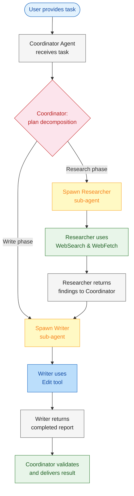
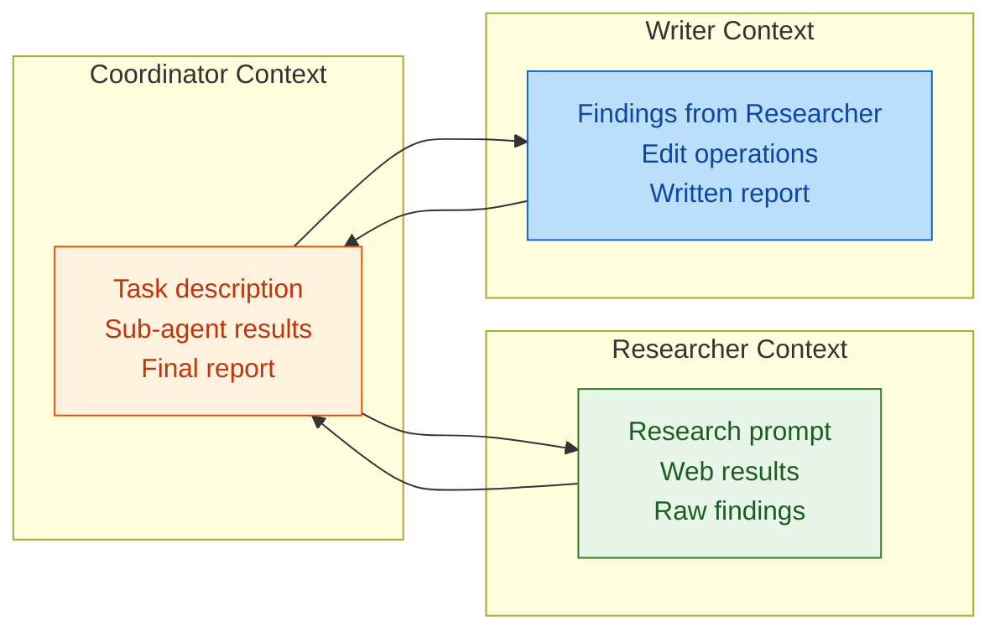
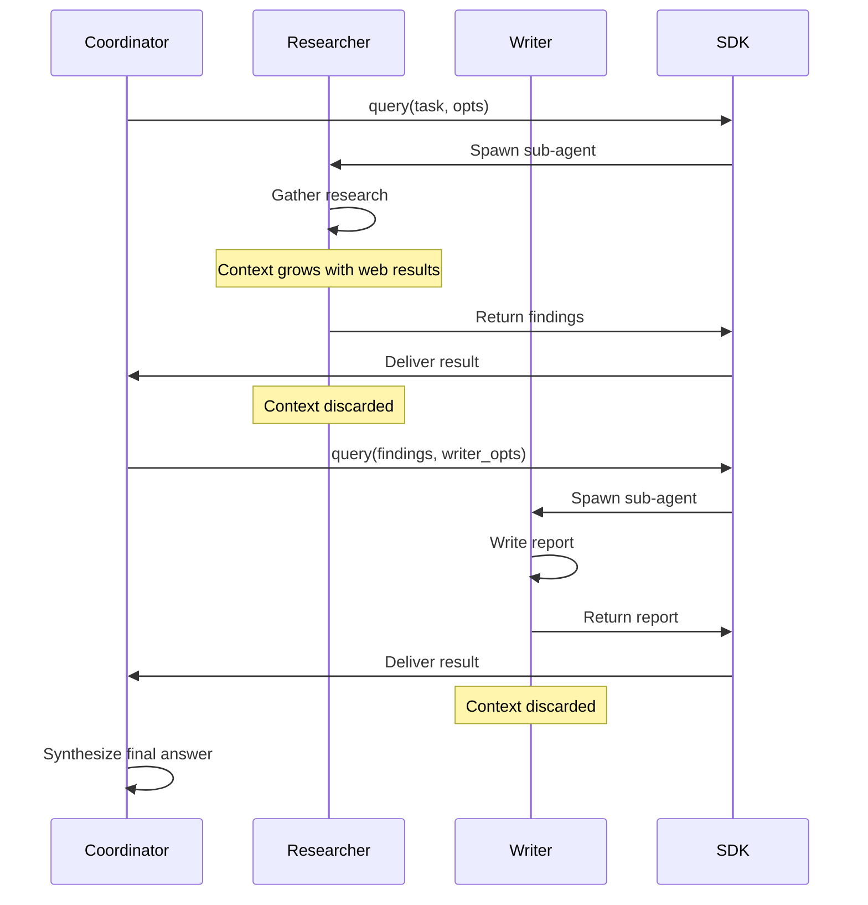

# Module 5: Context Management & Multi-Agent Orchestration

In Modules 1-4, you built a single agent with read, write, and observability capabilities. But real-world tasks quickly consume the 200,000 token context window. Passing the entire conversation history to one agent leads to degradation, irrelevant context, and rising costs.

Module 5 introduces **multi-agent orchestration** — a "Coordinator" agent delegates tightly scoped tasks to specialized "Sub-agents" with restricted toolsets. Each sub-agent operates in its own context window, keeping individual sessions small and focused. You'll build a Research & Synthesis Pipeline that separates data gathering from report writing across two isolated agents.

---

# Problem Statement / Use Case Overview

How do you build an agent system that can handle complex, multi-step tasks without blowing through the context window?

**The pipeline works in three stages:**

1. **Orchestration** — A Coordinator agent receives a high-level task, plans the work, and delegates to sub-agents.
2. **Isolated execution** — Each sub-agent runs in its own context window with its own tools. The Researcher only has `WebSearch` and `WebFetch`. The Writer only has `Edit`.
3. **Synthesis** — The Coordinator collects results and produces a final deliverable.

This is especially useful for:
- **Research tasks** where gathering and writing are separate concerns
- **Complex workflows** that exceed a single context window
- **Permission isolation** where no single agent has all capabilities
- **Cost optimization** by keeping each agent's context small

---

# Input Data

| Item | Detail |
|------|--------|
| **System prompt** | Coordinator defines the plan; sub-agents have role-specific instructions |
| **User task** | Natural-language task requiring research and synthesis |
| **Coordinator agent** | Top-level agent that delegates work |
| **Researcher sub-agent** | Equipped with `WebSearch` and `WebFetch` only |
| **Writer sub-agent** | Equipped with `Edit` only |
| **Target project** | Path to a project with a report template to fill in |
| **Anthropic API Key** | Used to authenticate with the Claude API |

---

# Processing

### Overall Workflow



### Context Window Breakdown



1. **Coordinator context** — Holds the high-level task, intermediate results from sub-agents, and the final deliverable. Never sees raw web pages or edit diffs.
2. **Researcher context** — Contains only the research prompt, web search results, and fetched page content. Toolset limited to `WebSearch` and `WebFetch`.
3. **Writer context** — Receives only the researcher's condensed findings, then edits the report template. Toolset limited to `Edit`.

### Token Efficiency Comparison

| Approach | Context Per Agent | Total Tokens | Degradation Risk |
|----------|------------------|--------------|------------------|
| Single agent | Full history (~200k) | ~200k | High — context drift over long sessions |
| Multi-agent (this lab) | Coordinator ~5k, Researcher ~15k, Writer ~10k | ~30k | Low — each agent stays focused |

### Context Compaction Triggers

The SDK provides built-in auto-compaction that kicks in when:

| Trigger | Behavior |
|---------|----------|
| Token threshold exceeded | SDK summarizes older turns to free space |
| Manual compaction request | Call `compaction()` to trigger immediately |
| Sub-agent handoff | Natural compaction point — sub-agent context is discarded after return |

---

# Output

A completed research report with gathered facts synthesized into structured markdown. The Coordinator returns a summary of what was researched and written:

> ## Research Report: Quantum Computing
>
> ### Summary
> Quantum computing leverages superposition and entanglement to solve problems classical computers cannot. Current challenges include decoherence and error rates.
>
> ### Key Findings
> - Qubits use superposition for parallel computation
> - Entanglement enables correlated operations across qubits
> - Applications include drug discovery, cryptography, optimization
>
> ### Implications
> Quantum computing will transform industries once error correction matures, expected within 5-10 years.

---

# Tech Stack

| Component | Tool |
|---|---|
| **Agent SDK** | Anthropic Agent SDK (`claude_agent_sdk`) — orchestrates agent loop with context management |
| **LLM (Coordinator)** | Claude via Anthropic API — plans and delegates |
| **LLM (Researcher)** | Claude via Anthropic API — gathers data with web tools |
| **LLM (Writer)** | Claude via Anthropic API — writes report with Edit tool |
| **Web Tools** | `WebSearch`, `WebFetch` — research capabilities |
| **Edit Tool** | `Edit` — file modification for report writing |
| **Language** | Python 3.10+ |
| **Environment** | `ANTHROPIC_API_KEY` (SDK) |

---

# Underlying Concepts (Summarized)

### Single Agent vs Multi-Agent

| Aspect | Single Agent | Multi-Agent (Orchestrator) |
|--------|-------------|---------------------------|
| **Context** | One large window | Multiple small windows |
| **Toolset** | All tools available | Per-agent restricted tools |
| **Permission** | One permission scope | Isolated per sub-agent |
| **Failure mode** | Single point of failure | Sub-agent failures contained |
| **Cost** | Higher per-turn (large context) | Lower per-turn (small context) |

### Coordinator Pattern

```python
async def run_researcher(topic: str) -> str:
    """Spawn a researcher sub-agent with web tools only."""
    options = ClaudeAgentOptions(
        allowed_tools=["WebSearch", "WebFetch"],
    )
    result = ""
    async for message in query(
        prompt=f"Research: {topic}. Return concise findings.",
        options=options
    ):
        if hasattr(message, 'content'):
            result = message.content
    return result
```

### Sub-agent Isolation

Each sub-agent:
- Gets its own `ClaudeAgentOptions` with a restricted toolset
- Runs in a separate `query()` call with its own context window
- Returns only the result string (not the full conversation)
- Its context is discarded after return — no accumulation

### Context Compaction Flow



### Multi-Agent Checklist

Before deploying a multi-agent system:

1. **Define clear interfaces** — What does each sub-agent take as input and return as output?
2. **Restrict tools per agent** — Never give a sub-agent tools it doesn't need
3. **Keep sub-agent tasks small** — One research question, one file edit, not both
4. **Pass condensed context** — Summarize before handing off to the next agent
5. **Validate results** — The coordinator should check sub-agent outputs before using them
6. **Monitor context size** — Watch token usage to identify compaction opportunities

---

# Pre-requisites

- **Basic familiarity** with Python (functions, `import` statements, `async`/`await`).
- **Anthropic API Key** — for the Agent SDK (sign up at [console.anthropic.com](https://console.anthropic.com)).
- **Python 3.10+** installed on your machine.
- **A project with a report template** the Writer can edit.
- **High-level understanding** of context windows and token limits.
- **Completion of Modules 1-4** recommended.

---

# Environment / Dependencies Setup

The cell below installs all required Python packages:

| Package | Purpose |
|---------|---------|
| `claude-agent-sdk` | **Agent SDK** — orchestrates multi-agent loop with context management |
| `python-dotenv` | **Environment** — loads API keys from .env file |

> **Note:** Run this cell first — it only needs to be run once per session.

```python
!pip install -q claude-agent-sdk python-dotenv
```

## Import Libraries

Import the standard library and SDK modules. **`os`** handles environment variables. **`json`** structures sub-agent communication. **`claude_agent_sdk`** provides `query`, `ClaudeAgentOptions`, and hook infrastructure.

```python
import os
import json
import asyncio
from dotenv import load_dotenv
from claude_agent_sdk import query, ClaudeAgentOptions
```

## Configure API Keys

| Key | Used By | Purpose |
|-----|---------|---------|
| `ANTHROPIC_API_KEY` | Agent SDK | Claude model for all agents |

```python
load_dotenv()

ANTHROPIC_API_KEY = os.getenv("ANTHROPIC_API_KEY")

print(f"Anthropic key (SDK): {'Yes' if ANTHROPIC_API_KEY else 'No'}")
```

---

# Step-wise Instructions — Development

---

### Step 1 — Define the Researcher Sub-agent

Create a sub-agent that only has `WebSearch` and `WebFetch` tools. Its job is to gather information on a given topic and return concise findings. The researcher has no write access — it can only observe the web.

```python
async def run_researcher(topic: str) -> str:
    """Gather research on a topic using web tools only."""
    options = ClaudeAgentOptions(
        allowed_tools=["WebSearch", "WebFetch"],
        model="claude-haiku-4-5-20251001",
    )
    prompt = f"""Research the topic '{topic}' and return concise findings.
You MUST call WebSearch first to find relevant information, then WebFetch to read details.
Return a bullet-point summary of the most important facts only."""
    result = ""
    async for message in query(prompt=prompt, options=options):
        if hasattr(message, 'content') and message.content:
            result = message.content
        if hasattr(message, 'result') and message.result:
            result = message.result
    return result
```

---

### Step 2 — Define the Writer Sub-agent

Create a sub-agent that only has the `Edit` tool. Its job is to take the researcher's findings and write them into the report template. The writer has no web access — it can only modify files.

```python
async def run_writer(findings: str, template_path: str, output_path: str) -> str:
    """Write findings into the report template using Edit tool only."""
    options = ClaudeAgentOptions(
        allowed_tools=["Read", "Edit"],
        permission_mode="bypassPermissions",
        model="claude-haiku-4-5-20251001",
    )
    prompt = f"""Read the template at {template_path}, then write a completed
report to {output_path} using the Edit tool.

Findings to incorporate:
{findings}

Replace every placeholder in the template with real content.
Do NOT modify any other files."""
    result = ""
    async for message in query(prompt=prompt, options=options):
        if hasattr(message, 'content') and message.content:
            result = message.content
        if hasattr(message, 'result') and message.result:
            result = message.result
    return result
```

---

### Step 3 — Define the Coordinator

Create the top-level Coordinator that ties everything together. The Coordinator receives the user's task, spawns the Researcher, passes findings to the Writer, and returns the final result.

```python
async def run_coordinator(task: str, template_path: str, output_path: str) -> str:
    """Orchestrate research and writing phases."""
    print("[Coordinator] Starting research phase...")
    findings = await run_researcher(task)
    print(f"[Coordinator] Research complete. {len(findings)} chars gathered.")

    print("[Coordinator] Starting writing phase...")
    report = await run_writer(findings, template_path, output_path)
    print("[Coordinator] Report written.")

    return report
```

---

### Step 4 — Execute the Pipeline

Set the target paths and run the full orchestration. The Coordinator manages context isolation automatically — each sub-agent gets its own fresh context window.

```python
TEMPLATE_PATH = "data/report_template.md"
OUTPUT_PATH = "data/completed_report.md"
TASK = "Quantum Computing"

result = await run_coordinator(TASK, TEMPLATE_PATH, OUTPUT_PATH)
print("\n--- Final Report ---\n")
print(result)
```

---

### Step 5 — Verify the Output

Read the completed report to verify the Writer properly filled in the template.

```python
from pathlib import Path

report_file = Path(OUTPUT_PATH)
if report_file.exists():
    print("--- Completed Report ---")
    print(report_file.read_text())
else:
    print("Report not found.")
```

---

# Optional Exercise

Challenge yourself to extend or modify this lab:

- Add a **Reviewer** sub-agent that checks the Writer's output for quality before final delivery.
- Implement **parallel research** by spawning multiple Researcher sub-agents concurrently.
- Add **context compaction logging** to track how many tokens are saved vs. a single-agent approach.
- Build a **retry mechanism** that re-spawns a sub-agent if it fails or times out.
- Add a **human-in-the-loop** step where the Coordinator asks for approval before handing off to the Writer.
- Create a **third sub-agent** (e.g., a "Formatter" with only `Bash` to run a linter on the output).

---

# What We Learnt

You built a **multi-agent orchestration system** that isolates context windows and restricts tools per agent.

**Key takeaways:**
- **Multi-agent architecture** — A Coordinator delegates to specialized sub-agents instead of doing everything in one context window.
- **Context isolation** — Each sub-agent runs in its own `query()` call with its own context, keeping individual windows small.
- **Tool restriction** — Sub-agents get only the tools they need (Researcher: web, Writer: Edit), reducing risk.
- **Token efficiency** — Three small context windows (~30k total) instead of one giant window (~200k).
- **Modular design** — Sub-agents can be added, removed, or replaced without affecting the rest of the pipeline.
- **Compaction readiness** — Sub-agent handoffs are natural compaction points where context is discarded.
- **Production pattern** — This coordinator/sub-agent pattern is used in production multi-agent systems.
