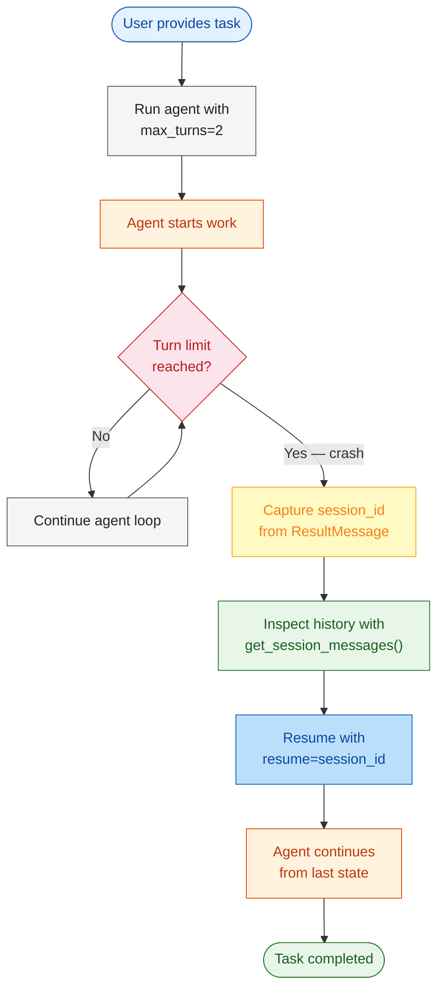
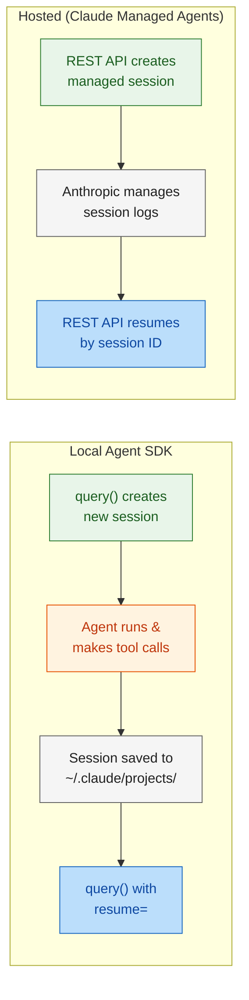

# Module 6: Path to Production

In Modules 1-5, you built, secured, observed, and orchestrated agents in a local development environment. But production deployment requires resilience — agents crash, networks fail, and long-running tasks exceed timeouts.

Module 6 introduces **session persistence and recovery** — the ability to capture an agent's session state, artificially crash the loop, and resume exactly where it left off. You'll implement a recovery script that uses `get_session_messages()` and `resume` to restore a failed agent workflow without losing progress.

---

# Problem Statement / Use Case Overview

How do you make an agent resilient to crashes, timeouts, and interruptions without losing work?

**The pipeline works in three stages:**

1. **Session capture** — Run an agent task and capture the `session_id` from `ResultMessage`.
2. **Simulated crash** — Let the agent hit `max_turns` or raise an exception to simulate a failure.
3. **Session recovery** — Use `get_session_messages()` to inspect history and `resume=<session_id>` to continue exactly where it stopped.

This is especially useful for:
- **Long-running tasks** that exceed turn or token limits
- **Unstable environments** where processes may be killed
- **Deferred processing** where work must survive host restarts
- **Audit and replay** — inspect exactly what an agent did before resuming

---

# Input Data

| Item | Detail |
|------|--------|
| **System prompt** | Instructions defining the agent's role |
| **User task** | A multi-step refactoring task that requires several tool calls |
| **Session ID** | Captured from `ResultMessage.session_id` after the first run |
| **Session store** | Local filesystem under `~/.claude/projects/` |
| **Crash trigger** | `max_turns=2` to force an early termination |
| **Recovery prompt** | Instructs the agent to continue from where it left off |
| **Anthropic API Key** | Used to authenticate with the Claude API |

---

# Processing

### Overall Workflow



### Session Lifecycle



### Local vs Hosted Comparison

| Aspect | Local Agent SDK | Hosted (Claude Managed Agents) |
|--------|---------------|-------------------------------|
| **Session storage** | Local filesystem (`~/.claude/projects/`) | Anthropic-managed durable storage |
| **Resume mechanism** | `resume=<session_id>` in options | REST API with session ID |
| **State persistence** | Survives process restarts on same machine | Survives across machines and regions |
| **Session inspection** | `get_session_messages()`, `list_sessions()` | API endpoints for log access |
| **Infrastructure** | You own the harness | Anthropic manages sandboxes and scaling |

### Session API Functions

| Function | Purpose |
|----------|---------|
| `list_sessions()` | List all sessions in the current project directory |
| `get_session_info(id)` | Read metadata for a session without parsing the full transcript |
| `get_session_messages(id)` | Reconstruct the message chain from a session transcript |
| `fork_session(id)` | Copy a session's transcript into a new session file |
| `ClaudeAgentOptions(resume=id)` | Continue a session from where it left off |

---

# Output

A resilient agent workflow that survives crashes and resumes seamlessly:

```
--- Session Resumption Demo ---

[Run 1] Starting with max_turns=2...
  Turn 1: agent lists files in data/
  Turn 2: agent reads task_state.json
  → Turn limit reached. Session ID: ses_abc123

[Inspect] Session has 4 messages (1 user + 3 assistant)

[Run 2] Resuming session ses_abc123...
  Agent continues: reads work_in_progress.txt
  Agent completes the refactoring task
  → Task finished successfully
```

---

# Tech Stack

| Component | Tool |
|---|---|
| **Agent SDK** | Anthropic Agent SDK (`claude_agent_sdk`) — session management and query execution |
| **LLM** | Claude via Anthropic API — reasons about tasks and selects tools |
| **Session API** | `get_session_messages()`, `list_sessions()`, `resume` option |
| **Session Store** | Local filesystem (`~/.claude/projects/`) |
| **Language** | Python 3.10+ |
| **Environment** | `ANTHROPIC_API_KEY` (SDK) |

---

# Underlying Concepts (Summarized)

### Session Persistence

Every `query()` call creates a session that persists to disk. The session transcript stores:
- User prompts
- Assistant responses and tool calls
- Tool results
- Metadata (model, timestamps, token counts)

Sessions are stored as JSONL files under `~/.claude/projects/<encoded-cwd>/`.

### Resume vs Continue

| Mode | How It Works | When To Use |
|------|-------------|-------------|
| `continue_conversation=True` | Picks up the most recent session in the current directory | Single-user, one conversation at a time |
| `resume=<session_id>` | Loads a specific session by ID | Multi-user, cross-session, recovery scenarios |

### Crash Recovery Pattern

The recovery pattern has three steps:

1. **Run with bounds** — Set `max_turns` or `max_budget_usd` so the session ends predictably instead of crashing mid-operation.
2. **Capture the session ID** — Extract `session_id` from `ResultMessage` before the loop exits.
3. **Resume with context** — Call `query()` again with `resume=<session_id>`. The agent loads full history and continues.

### Session Message Structure

```python
from claude_agent_sdk import get_session_messages

messages = get_session_messages(session_id)
for msg in messages:
    print(f"[{msg.type}] {msg.uuid}")
    # msg.type: "user" | "assistant"
    # msg.message: dict with role, content blocks
    # msg.uuid: stable identifier for this message
```

### Production Readiness Checklist

Before deploying an agent to production:

1. **Set bounds** — Always configure `max_turns` or `max_budget_usd` to prevent runaway costs.
2. **Capture session IDs** — Store `session_id` externally (database, file, log) for recovery.
3. **Implement retry logic** — Wrap `query()` in a retry loop that resumes on failure.
4. **Test crash recovery** — Artificially terminate sessions and verify resumption works.
5. **Choose deployment model** — Local SDK for self-hosted, Managed Agents for Anthropic-hosted.
6. **Monitor session storage** — Clean up old sessions to avoid disk bloat with `delete_session()`.

---

# Pre-requisites

- **Basic familiarity** with Python (functions, `async`/`await`, exception handling).
- **Anthropic API Key** — for the Agent SDK (sign up at [console.anthropic.com](https://console.anthropic.com)).
- **Python 3.10+** installed on your machine.
- **A project with files** the agent can read and modify.
- **Completion of Modules 1-5** recommended.

---

# Environment / Dependencies Setup

The cell below installs all required Python packages:

| Package | Purpose |
|---------|---------|
| `claude-agent-sdk` | **Agent SDK** — query execution and session management |
| `python-dotenv` | **Environment** — loads API keys from .env file |

> **Note:** Run this cell first — it only needs to be run once per session.

```python
!pip install -q claude-agent-sdk python-dotenv
```

## Import Libraries

```python
import os
import json
import asyncio
from pathlib import Path
from dotenv import load_dotenv
from claude_agent_sdk import (
    query, ClaudeAgentOptions,
    ResultMessage,
    get_session_messages, list_sessions,
)
```

## Configure API Keys

| Key | Used By | Purpose |
|-----|---------|---------|
| `ANTHROPIC_API_KEY` | Agent SDK | Claude model for all agents |

```python
load_dotenv()

ANTHROPIC_API_KEY = os.getenv("ANTHROPIC_API_KEY")

print(f"Anthropic key (SDK): {'Yes' if ANTHROPIC_API_KEY else 'No'}")
```

---

# Step-wise Instructions — Development

---

### Step 1 — Run an Agent with a Turn Limit

Run an agent with `max_turns=2` so it terminates early, simulating a crash. Capture the `session_id` from the `ResultMessage`.

```python
async def run_with_crash(task: str, session_store=None):
    """Run agent with a low turn limit to simulate a crash."""
    options = ClaudeAgentOptions(
        allowed_tools=["Read", "Glob", "Grep", "Edit"],
        max_turns=2,
        session_store=session_store,
    )
    session_id = None
    try:
        async for message in query(prompt=task, options=options):
            if isinstance(message, ResultMessage):
                session_id = message.session_id
                if message.subtype == "success":
                    print(f"[Done] {message.result[:200]}")
    except Exception as e:
        print(f"[Crash] {e}")

    return session_id
```

---

### Step 2 — Inspect the Session History

Use `get_session_messages()` to inspect what the agent did before the crash.

```python
def inspect_session(session_id: str):
    """Print the conversation history from a session."""
    messages = get_session_messages(session_id)
    print(f"\n--- Session {session_id[:8]}... ({len(messages)} messages) ---")
    for i, msg in enumerate(messages):
        role = msg.type.upper()
        preview = str(msg.message)[:120]
        print(f"  [{i}] {role}: {preview}")
    return messages
```

---

### Step 3 — Resume the Crashed Session

Resume the session using the captured `session_id`. The agent loads the full history and continues from the last state.

```python
async def resume_session(session_id: str, follow_up: str):
    """Resume a session from its last state."""
    options = ClaudeAgentOptions(
        allowed_tools=["Read", "Glob", "Grep", "Edit"],
        resume=session_id,
    )
    async for message in query(prompt=follow_up, options=options):
        if isinstance(message, ResultMessage) and message.subtype == "success":
            print(f"[Resumed] {message.result[:300]}")
```

---

### Step 4 — Run the Full Recovery Pipeline

Execute the complete crash-and-recover flow end-to-end.

```python
TASK = "Read data/task_state.json and data/work_in_progress.txt, then continue the refactoring work described."
FOLLOW_UP = "Continue exactly where you left off."

async def main():
    session_id = await run_with_crash(TASK)
    if session_id:
        inspect_session(session_id)
        await resume_session(session_id, FOLLOW_UP)

await main()
```

---

### Step 5 — List Available Sessions

Use `list_sessions()` to see all sessions stored on disk.

```python
sessions = list_sessions()
print(f"\n--- All Sessions ({len(sessions)}) ---")
for s in sessions:
    print(f"  {s.session_id[:12]}... | {s.first_prompt[:60]} | {s.created_at}")
```

---

# Optional Exercise

Challenge yourself to extend or modify this lab:

- Implement **automatic retry** — wrap the agent in a loop that catches failures and resumes automatically.
- Use `fork_session()` to branch from a crash point and try a different approach.
- Build a **session browser** that lists sessions, shows their messages, and lets you resume any of them.
- Implement a **session store adapter** that persists transcripts to a database instead of local files.
- Add `max_budget_usd` as an additional crash trigger and test recovery from budget limits.
- Compare local session resumption vs. the hosted Managed Agents model — note the differences.

---

# What We Learnt

You built a **crash-resilient agent** that survives interruptions and resumes exactly where it left off.

**Key takeaways:**
- **Session persistence** — Every `query()` creates a durable session transcript on disk.
- **Turn limits** — `max_turns` bounds agent execution and provides a clean termination point.
- **Session inspection** — `get_session_messages()` lets you read what the agent did without running it.
- **Session resumption** — `resume=<session_id>` restores full context from a previous session.
- **Crash recovery pattern** — Run with bounds, capture the session ID, resume after failure.
- **Local vs hosted** — Local SDK stores sessions on disk; Managed Agents use Anthropic-hosted storage.
- **Production readiness** — Session IDs enable retry logic, audit trails, and long-running task support.
