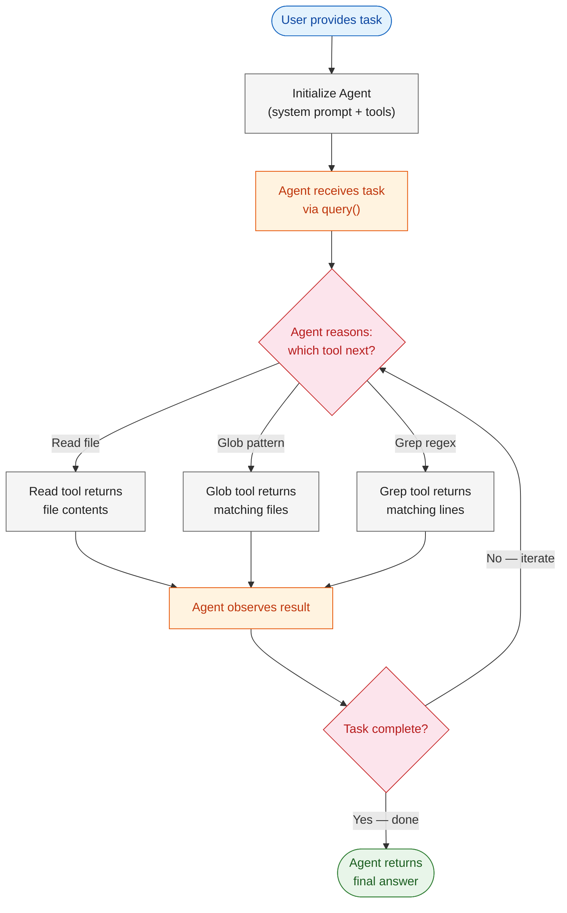
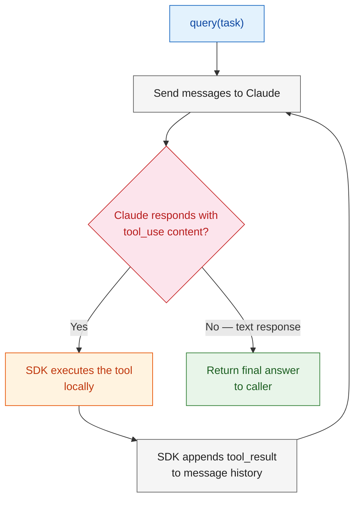

# Module 1: The Agent Loop & Built-in Tools

> **The Agent SDK** handles the iterative tool-use loop automatically, allowing Claude to reason, act, observe, and adjust without manual intervention. Instead of manually calling the API, parsing responses, executing tools, and feeding results back, the SDK orchestrates the entire cycle — turning a single user prompt into a multi-step autonomous workflow.

---

# Problem Statement / Use Case Overview

How do we build an agent that can autonomously explore a codebase, find specific patterns, and produce a structured report — without writing the loop logic ourselves?

**The pipeline works in three stages:**

1. **Agent initialization** — Configure an agent with a system prompt and a set of allowed tools (Read, Glob, Grep).
2. **Autonomous execution** — The agent receives a task, reasons about which tools to use, calls them, observes results, and iterates until the task is complete.
3. **Output extraction** — The agent produces a final markdown summary of its findings.

This is especially useful for:
- **Codebase exploration and auditing**
- **Automated code review and reporting**
- **Finding TODO/FIXME/HACK comments across projects**
- **Any task where an LLM needs to read files, search patterns, and synthesize findings**

---

# Input Data

| Item | Detail |
|------|--------|
| **System prompt** | Instructions defining the agent's role and behavior |
| **User task** | Natural-language task describing what the agent should do |
| **Target directory** | Path to a local codebase the agent will explore |
| **Allowed tools** | Built-in tools: `Read`, `Glob`, `Grep` |
| **Anthropic API Key** | Used to authenticate with the Claude API |

---

# Processing

### Overall Workflow



### The Agent Loop Internals



1. **`query(task)`** — You call `agent.query()` with a natural-language task. This is the only entry point you need.
2. **Message loop** — The SDK sends the task to Claude along with the conversation history and tool definitions. Claude analyzes the task and decides what to do.
3. **Tool execution** — If Claude responds with a `tool_use` block, the SDK automatically executes that tool (Read, Glob, or Grep) on your local filesystem. You do not write the execution logic.
4. **Observation** — The SDK appends the tool result as a `tool_result` message and sends the updated conversation back to Claude.
5. **Iteration** — Steps 2–4 repeat until Claude produces a final text response (no more tool calls), at which point the SDK returns the answer.

The key difference from a manual API call: **you never handle the loop yourself**. The SDK manages the message history, tool dispatch, and re-prompting automatically.

---

# Output

A structured markdown summary of all TODO and FIXME comments found in the target codebase, organized by file, including line numbers and surrounding context. For example:

> ## TODO / FIXME Summary
>
> ### src/utils.py
> - **Line 42** `TODO: Refactor this into a separate function` 
> - **Line 87** `FIXME: Handle edge case where input is None`
>
> ### src/api/client.py
> - **Line 15** `TODO: Add retry logic with exponential backoff`

---

# Tech Stack

| Component | Tool |
|---|---|
| **Agent SDK** | Anthropic Agent SDK (`agent`) — orchestrates the tool-use loop |
| **LLM** | Claude (via Anthropic API) — reasons about tasks and selects tools |
| **Built-in Tools** | `Read`, `Glob`, `Grep` — filesystem exploration tools |
| **Language** | Python 3.10+ |
| **Environment** | Environment variables — Anthropic API key set via `os.environ` |

---

# Underlying Concepts (Summarized)

### Standard Client SDK vs Agent SDK

| Aspect | Standard Client SDK | Agent SDK |
|--------|-------------------|-----------|
| **Tool loop** | Manual — you call the API, check for tool use, execute tools, and re-prompt | Automatic — `query()` handles the entire loop |
| **Message management** | You build and manage the message list yourself | SDK maintains conversation history internally |
| **Tool execution** | You write the dispatch logic | SDK executes tools automatically |
| **Use case** | Simple single-turn interactions | Multi-step autonomous workflows |

**Standard Client SDK** (`anthropic` package): You get a single response from Claude. If Claude wants to use a tool, it returns a `tool_use` content block. You must manually parse it, execute the tool, format the result, append it to the message list, and call the API again. This gives you full control but requires writing the loop.

**Agent SDK** (`agent` package): You call `agent.query(task)` and get back the final answer. The SDK internally handles the message loop, tool dispatch, and re-prompting. You define *what* tools are available, not *how* to call them.

### The `query()` Function

```python
response = agent.query("Find all TODO comments in src/")
```

This single call:
1. Sends the task to Claude with the system prompt and tool definitions
2. Loops: Claude responds → SDK executes tool → SDK re-prompts Claude
3. Returns the final text response when Claude stops calling tools

### Configuring `allowedTools`

You specify which tools the agent can use when creating it:

```python
agent = Agent(
    model="claude-sonnet-4-20250514",
    system_prompt="You are a code exploration assistant.",
    tools=[Read(), Glob(), Grep()],
)
```

Restricting tools is a security and focus mechanism — the agent can only do what you permit.

---

# Pre-requisites

- **Basic familiarity** with Python (functions, `import` statements).
- **Anthropic API Key** — sign up at [console.anthropic.com](https://console.anthropic.com).
- **Python 3.10+** installed on your machine.
- **A local codebase** to explore (any directory with `.py`, `.js`, `.ts`, etc. files).
- **High-level understanding** of what an LLM is and what "tool use" means.

---

# Environment / Dependencies Setup

The cell below installs all required Python packages:

| Package | Purpose |
|---------|---------|
| `anthropic` | **Anthropic SDK** — core API client for Claude |
| `agent` | **Agent SDK** — orchestrates the autonomous tool-use loop |
| `rich` | **Terminal formatting** — pretty-prints agent output and tool calls |

> **Note:** Run this cell first — it only needs to be run once per session.

```python
!pip install -q anthropic agent rich
```

## Import Libraries

Import the standard library and third-party modules used throughout the notebook. **`os`** handles environment variables. **`agent`** provides the `Agent` class and built-in tools. **`rich`** provides pretty-printing for terminal output.

```python
import os
from agent import Agent, Read, Glob, Grep
from rich.console import Console
from rich.markdown import Markdown
```

## Configure Anthropic API Key

Set your Anthropic API key as an environment variable. Copy the key from the key icon on your lab platform or from [console.anthropic.com](https://console.anthropic.com).

```python
os.environ["ANTHROPIC_API_KEY"] = "YOUR_API_KEY"

print("API key configured.")
```

---

# Step-wise Instructions — Development

---

### Step 1 — Initialize the Agent

Create an agent instance with a system prompt and the three built-in tools. The system prompt defines the agent's role and behavior. The tools list restricts what the agent can do.

#### Create the Agent

This cell creates an `Agent` with:
- **Model**: `claude-sonnet-4-20250514` — Claude's latest Sonnet model
- **System prompt**: Defines the agent as a code exploration assistant
- **Tools**: `Read()`, `Glob()`, `Grep()` — the three filesystem exploration tools

```python
agent = Agent(
    model="claude-sonnet-4-20250514",
    system_prompt=(
        "You are a code exploration assistant. "
        "Your job is to scan codebases, find specific patterns or comments, "
        "and produce structured markdown reports. "
        "Be thorough but concise. Always cite file paths and line numbers."
    ),
    tools=[Read(), Glob(), Grep()],
)

console = Console()
console.print("[bold green]Agent initialized.[/bold green]")
console.print(f"Model: {agent.model}")
console.print(f"Tools: {[t.__class__.__name__ for t in agent.tools]}")
```

---

### Step 2 — Define the Task

Define the task you want the agent to perform. The agent will use the allowed tools to autonomously explore the codebase and find all TODO and FIXME comments.

This is a simple but critical step. The `TASK` variable holds the natural-language instruction that drives the entire agent loop. The agent will parse this task, decide which tools to call first, and iterate until it has enough information to produce the summary.

The task determines which tools the agent will use. For example, asking to "find all TODO comments" will cause the agent to:
1. Use `Glob` to discover all source files
2. Use `Grep` to search for TODO/FIXME patterns
3. Use `Read` to get context around each match
4. Synthesize findings into a markdown report

```python
TARGET_DIR = "/path/to/your/codebase"  # <-- Change this to your target directory

TASK = f"""
Scan the codebase at {TARGET_DIR} and find all TODO and FIXME comments.

For each match, report:
- File path
- Line number
- The comment text
- A brief note on what the comment is about

Organize the results as a markdown summary grouped by file.
"""
```

---

### Step 3 — Run the Agent Loop

Call `agent.query()` with the task. The SDK handles the entire loop: sending the task to Claude, executing tools, re-prompting, and returning the final answer.

Here is exactly what happens under the hood:

1. **First prompt** — The SDK sends the task to Claude along with the system prompt and tool definitions. Claude analyzes the task and decides to call `Glob` to discover files.
2. **Tool execution** — The SDK receives Claude's `tool_use` response, executes the `Glob` tool locally, and appends the result as a `tool_result`.
3. **Re-prompt** — The SDK sends the updated conversation back to Claude. Claude sees the file list and decides to call `Grep` to find TODO/FIXME patterns.
4. **More iterations** — Claude may call `Grep` multiple times with different patterns, or call `Read` to get context around specific matches.
5. **Final answer** — When Claude has gathered enough information, it produces a text response (no more tool calls) and the SDK returns it.

The key insight: **you never see the loop**. You call `query()` once and get the final answer. But under the hood, Claude may have made 5, 10, or 20 tool calls to complete the task.

```mermaid
flowchart LR
    A["agent.query(TASK)"] --> B["Claude: call Glob"]
    B --> C["SDK: execute Glob"]
    C --> D["Claude: call Grep"]
    D --> E["SDK: execute Grep"]
    E --> F["Claude: call Read"]
    F --> G["SDK: execute Read"]
    G --> H["Claude: final answer"]
    H --> I["Return to caller"]

    style A fill:#e3f2fd,stroke:#1565c0,color:#0d47a1
    style B fill:#fff3e0,stroke:#e65100,color:#bf360c
    style C fill:#f5f5f5,stroke:#616161,color:#212121
    style D fill:#fff3e0,stroke:#e65100,color:#bf360c
    style E fill:#f5f5f5,stroke:#616161,color:#212121
    style F fill:#fff3e0,stroke:#e65100,color:#bf360c
    style G fill:#f5f5f5,stroke:#616161,color:#212121
    style H fill:#e8f5e9,stroke:#2e7d32,color:#1b5e20
    style I fill:#e8f5e9,stroke:#2e7d32,color:#1b5e20
```



```python
response = agent.query(TASK)

console.print("\n[bold cyan]--- Agent Response ---[/bold cyan]\n")
console.print(Markdown(response))
```

---

### Step 4 — Save the Report

Save the agent's output to a markdown file for later reference.

```python
REPORT_PATH = "todo_fixme_report.md"

with open(REPORT_PATH, "w") as f:
    f.write(f"# TODO / FIXME Report\n\n")
    f.write(f"Generated by scanning: `{TARGET_DIR}`\n\n")
    f.write(response)

console.print(f"[bold green]Report saved to {REPORT_PATH}[/bold green]")
```

---

# Optional Exercise

Challenge yourself to extend or modify this lab:

- Change the task to find a different pattern (e.g., `HACK`, `XXX`, `DEPRECATED`, `@deprecated`).
- Add more tools to the agent (e.g., `Bash` for running commands, `Write` for creating files) and observe how the agent's behavior changes.
- Try a different target directory and compare the results.
- Modify the system prompt to make the agent more verbose or more concise in its reporting.
- Use a different Claude model (e.g., `claude-haiku-4-20250414`) and compare speed vs. quality.

---

# What We Learnt

You built a **single-agent loop** that autonomously explores a codebase and generates a structured report — without writing any loop logic yourself.

**Key takeaways:**
- **Agent SDK vs Client SDK** — The Client SDK requires you to manually handle the tool-use loop. The Agent SDK automates it via `query()`.
- **`query()` is the entry point** — One call handles the entire multi-step workflow: reasoning, tool execution, observation, and iteration.
- **Built-in tools** — `Read`, `Glob`, and `Grep` give the agent filesystem exploration capabilities without any custom tool implementation.
- **`allowedTools` restricts scope** — You control what the agent can do by specifying which tools it has access to.
- **The agent reasons about tool use** — Claude decides which tool to call, what arguments to pass, and when to stop — all based on the task description and system prompt.
